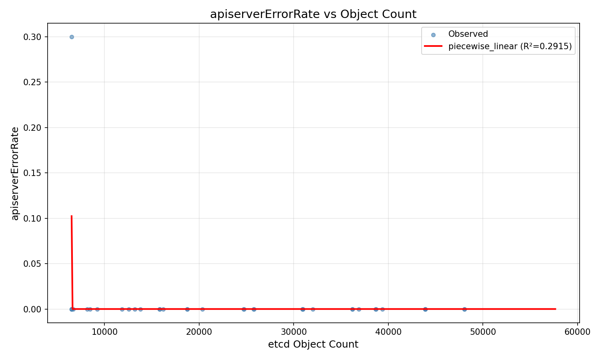
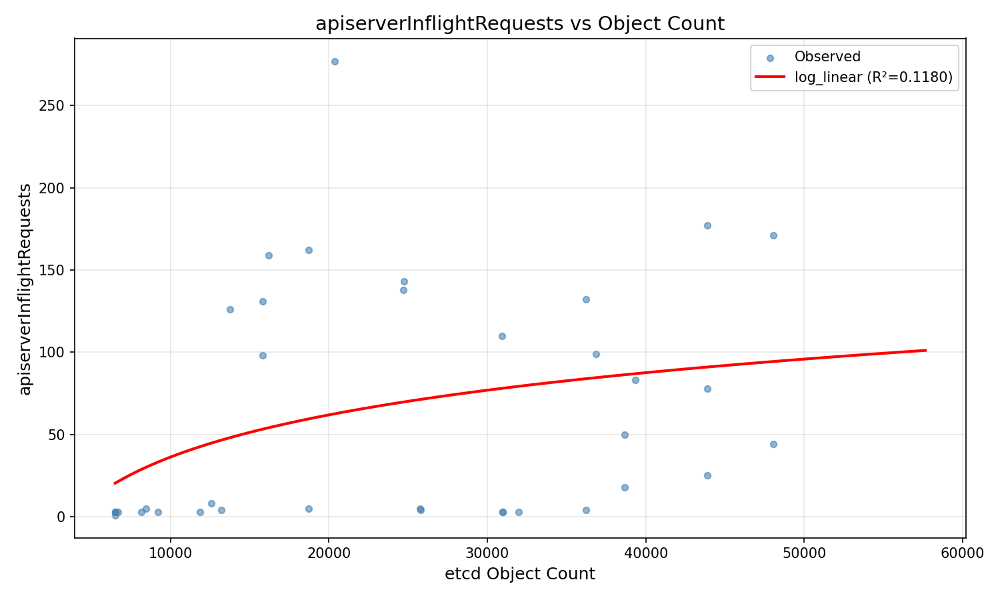
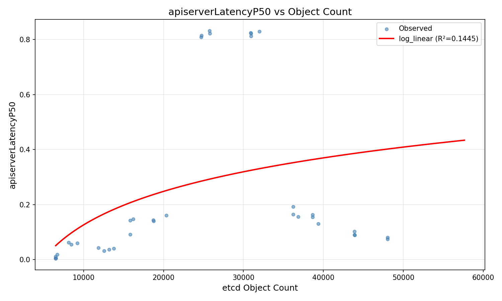
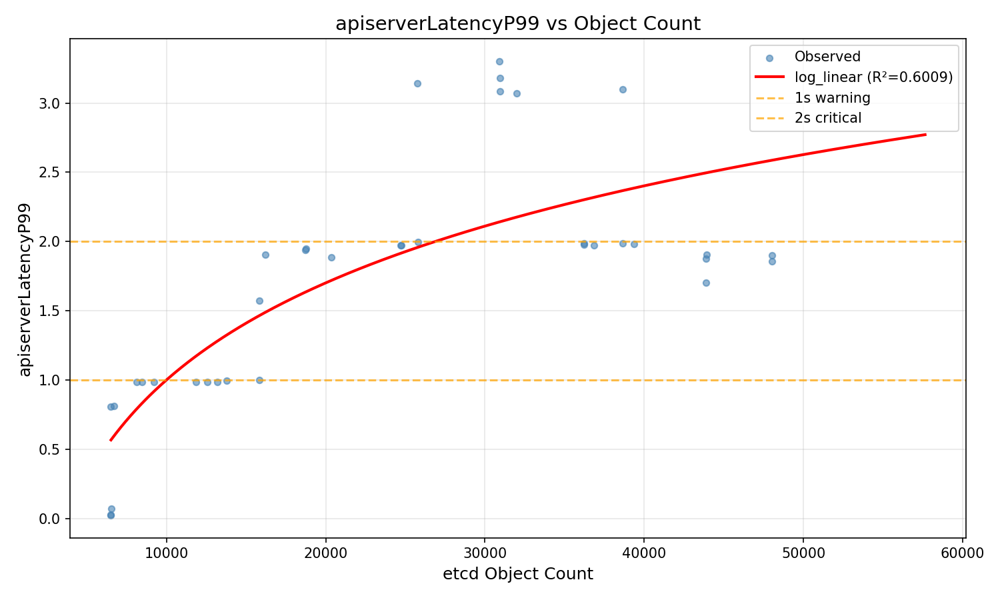
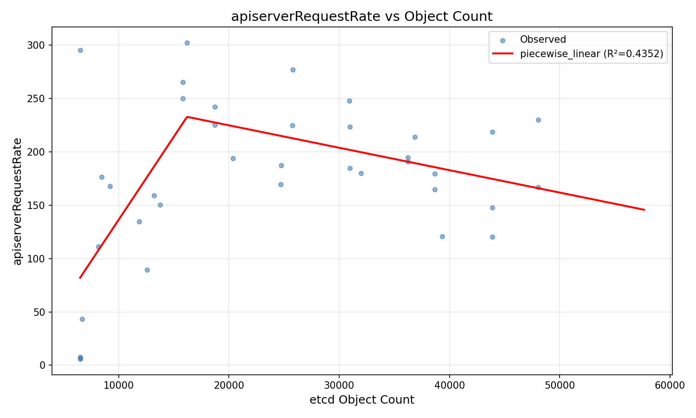
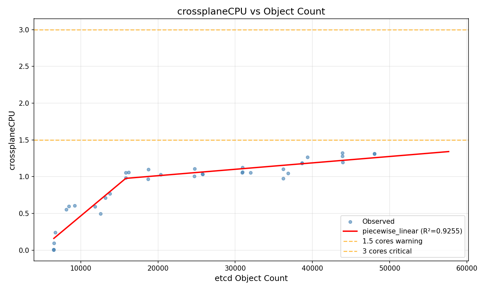
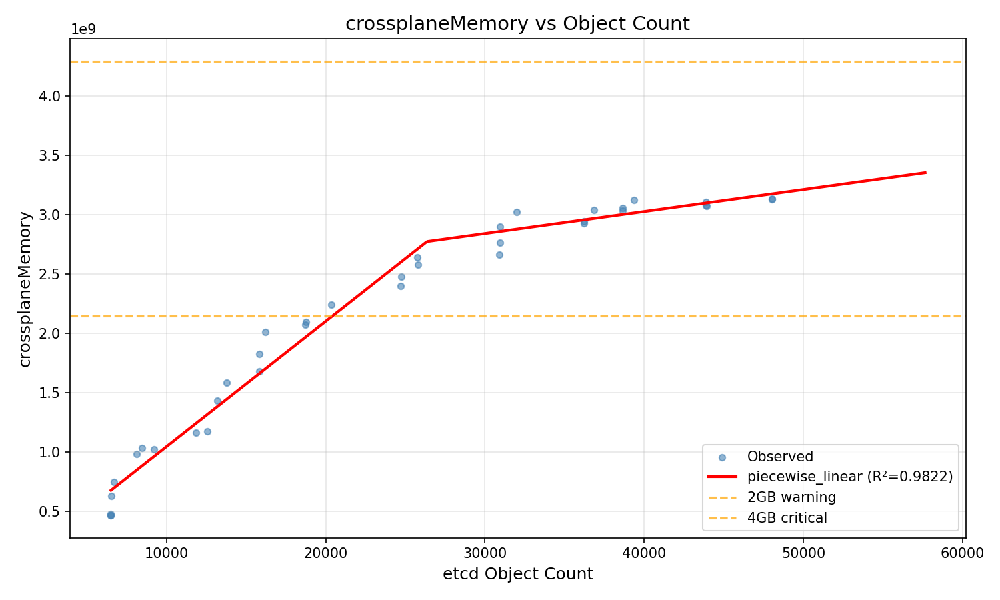
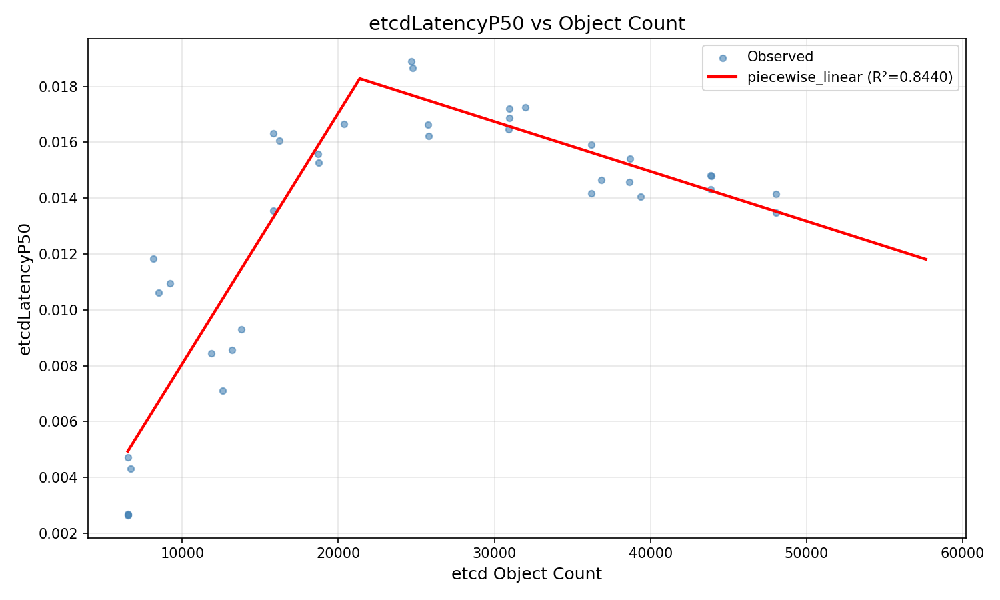
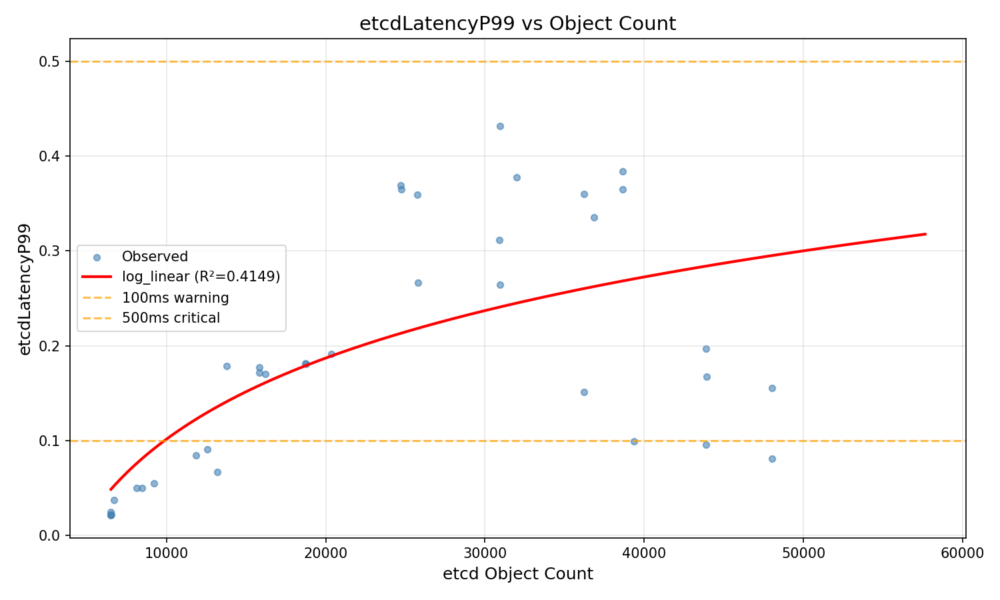

# Crossplane etcd Capacity Planning Report

**Generated**: 2026-02-28 16:31:29

## Executive Summary

- **etcdLatencyP99**: Best fit is **log_linear** (R²=0.4149): `y = 1.232885e-01 * ln(x) + -1.033989e+00`
  - 100ms warning reached at **9,872** objects
  - 500ms critical reached at **253,906** objects
- **etcdLatencyP50**: Best fit is **piecewise_linear** (R²=0.8440): `y = 8.980524e-07*x + -9.097797e-04 (x<=21370), -1.783597e-07*x + 2.209306e-02 (x>21370)`
- **apiserverLatencyP99**: Best fit is **log_linear** (R²=0.6009): `y = 1.010954e+00 * ln(x) + -8.310636e+00`
  - 1s warning reached at **9,995** objects
  - 2s critical reached at **26,855** objects
- **apiserverLatencyP50**: Best fit is **log_linear** (R²=0.1445): `y = 1.758197e-01 * ln(x) + -1.493390e+00`
- **crossplaneMemory**: Best fit is **piecewise_linear** (R²=0.9822): `y = 1.056432e+05*x + -1.131568e+07 (x<=26361), 1.854968e+04*x + 2.284543e+09 (x>26361)`
  - 2GB warning reached at **20,447** objects
  - 4GB critical reached at **108,398** objects
- **crossplaneCPU**: Best fit is **piecewise_linear** (R²=0.9255): `y = 8.765912e-05*x + -4.105265e-01 (x<=15827), 8.712951e-06*x + 8.389544e-01 (x>15827)`
  - 1.5 cores warning reached at **75,928** objects
  - 3 cores critical reached at **248,047** objects
- **apiserverInflightRequests**: Best fit is **log_linear** (R²=0.1180): `y = 3.702490e+01 * ln(x) + -3.047945e+02`
- **apiserverRequestRate**: Best fit is **piecewise_linear** (R²=0.4352): `y = 1.553926e-02*x + -1.918795e+01 (x<=16208), -2.099710e-03*x + 2.667044e+02 (x>16208)`
- **apiserverErrorRate**: Best fit is **piecewise_linear** (R²=0.2915): `y = -9.090909e-03*x + 5.931136e+01 (x<=6524), -4.388551e-15*x + -1.247145e-10 (x>6524)`

## Detailed Analysis

### apiserverErrorRate

- **Data points**: 37
- **Range**: 0 — 0.3
- **Mean**: 0.008108
- **Best fit**: piecewise_linear (R²=0.2915)
- **Equation**: `y = -9.090909e-03*x + 5.931136e+01 (x<=6524), -4.388551e-15*x + -1.247145e-10 (x>6524)`
- **Predicted at 10,000 objects**: -1.686e-10
- **Predicted at 30,000 objects**: -2.564e-10
- **Predicted at 50,000 objects**: -3.441e-10
- **Predicted at 100,000 objects**: -5.636e-10
- **Predicted at 200,000 objects**: -1.002e-09

### apiserverInflightRequests

- **Data points**: 37
- **Range**: 1 — 277
- **Mean**: 61.81
- **Best fit**: log_linear (R²=0.1180)
- **Equation**: `y = 3.702490e+01 * ln(x) + -3.047945e+02`
- **Predicted at 10,000 objects**: 36.22
- **Predicted at 30,000 objects**: 76.89
- **Predicted at 50,000 objects**: 95.81
- **Predicted at 100,000 objects**: 121.5
- **Predicted at 200,000 objects**: 147.1

### apiserverLatencyP50

- **Data points**: 37
- **Range**: 0.004174 — 0.8326
- **Mean**: 0.2475
- **Best fit**: log_linear (R²=0.1445)
- **Equation**: `y = 1.758197e-01 * ln(x) + -1.493390e+00`
- **Predicted at 10,000 objects**: 0.126
- **Predicted at 30,000 objects**: 0.3191
- **Predicted at 50,000 objects**: 0.4089
- **Predicted at 100,000 objects**: 0.5308
- **Predicted at 200,000 objects**: 0.6527

### apiserverLatencyP99

- **Data points**: 37
- **Range**: 0.025 — 3.303
- **Mean**: 1.699
- **Best fit**: log_linear (R²=0.6009)
- **Equation**: `y = 1.010954e+00 * ln(x) + -8.310636e+00`
- **Predicted at 10,000 objects**: 1.001
- **Predicted at 30,000 objects**: 2.111
- **Predicted at 50,000 objects**: 2.628
- **Predicted at 100,000 objects**: 3.328
- **Predicted at 200,000 objects**: 4.029

### apiserverRequestRate

- **Data points**: 37
- **Range**: 6.067 — 302.3
- **Mean**: 174.7
- **Best fit**: piecewise_linear (R²=0.4352)
- **Equation**: `y = 1.553926e-02*x + -1.918795e+01 (x<=16208), -2.099710e-03*x + 2.667044e+02 (x>16208)`
- **Predicted at 10,000 objects**: 136.2
- **Predicted at 30,000 objects**: 203.7
- **Predicted at 50,000 objects**: 161.7
- **Predicted at 100,000 objects**: 56.73
- **Predicted at 200,000 objects**: -153.2

### crossplaneCPU

- **Data points**: 37
- **Range**: 0.005505 — 1.324
- **Mean**: 0.8791
- **Best fit**: piecewise_linear (R²=0.9255)
- **Equation**: `y = 8.765912e-05*x + -4.105265e-01 (x<=15827), 8.712951e-06*x + 8.389544e-01 (x>15827)`
- **Predicted at 10,000 objects**: 0.4661
- **Predicted at 30,000 objects**: 1.1
- **Predicted at 50,000 objects**: 1.275
- **Predicted at 100,000 objects**: 1.71
- **Predicted at 200,000 objects**: 2.582

### crossplaneMemory

- **Data points**: 37
- **Range**: 4.684e+08 — 3.137e+09
- **Mean**: 2.113e+09
- **Best fit**: piecewise_linear (R²=0.9822)
- **Equation**: `y = 1.056432e+05*x + -1.131568e+07 (x<=26361), 1.854968e+04*x + 2.284543e+09 (x>26361)`
- **Predicted at 10,000 objects**: 1.045e+09
- **Predicted at 30,000 objects**: 2.841e+09
- **Predicted at 50,000 objects**: 3.212e+09
- **Predicted at 100,000 objects**: 4.14e+09
- **Predicted at 200,000 objects**: 5.994e+09

### etcdLatencyP50

- **Data points**: 37
- **Range**: 0.002654 — 0.01891
- **Mean**: 0.01286
- **Best fit**: piecewise_linear (R²=0.8440)
- **Equation**: `y = 8.980524e-07*x + -9.097797e-04 (x<=21370), -1.783597e-07*x + 2.209306e-02 (x>21370)`
- **Predicted at 10,000 objects**: 0.008071
- **Predicted at 30,000 objects**: 0.01674
- **Predicted at 50,000 objects**: 0.01318
- **Predicted at 100,000 objects**: 0.004257
- **Predicted at 200,000 objects**: -0.01358

### etcdLatencyP99

- **Data points**: 37
- **Range**: 0.02155 — 0.4318
- **Mean**: 0.1868
- **Best fit**: log_linear (R²=0.4149)
- **Equation**: `y = 1.232885e-01 * ln(x) + -1.033989e+00`
- **Predicted at 10,000 objects**: 0.1015
- **Predicted at 30,000 objects**: 0.237
- **Predicted at 50,000 objects**: 0.3
- **Predicted at 100,000 objects**: 0.3854
- **Predicted at 200,000 objects**: 0.4709

## Recommendations

Based on the analysis:

1. **Scale before 100k objects**: Projected etcd P99 latency at 100k objects is 385ms (exceeds 100ms threshold). Consider scaling etcd or reducing object count before reaching this point.
2. **Controller memory at 100k objects**: ~3.9GB. Increase resource limits.
3. **Monitor `crossplane:days_until_object_limit:30k`** alert for proactive scaling.
4. **Re-run this analysis** after any significant change in workload patterns.

## Methodology

- **Load generator**: kube-burner with Crossplane claims (VMDeployment, Disk, DNSZone, FirewallRuleSet)
- **Mock resources**: provider-nop NopResources (real etcd objects, no cloud resources)
- **Curve fitting**: scipy.optimize.curve_fit with linear, quadratic, and power-law models
- **Best model selection**: Highest R² (coefficient of determination)
- **Metrics source**: Prometheus via kube-burner metric collection
- **ROSA note**: Direct etcd_mvcc metrics not available; using etcd_request_duration and apiserver metrics as proxies
